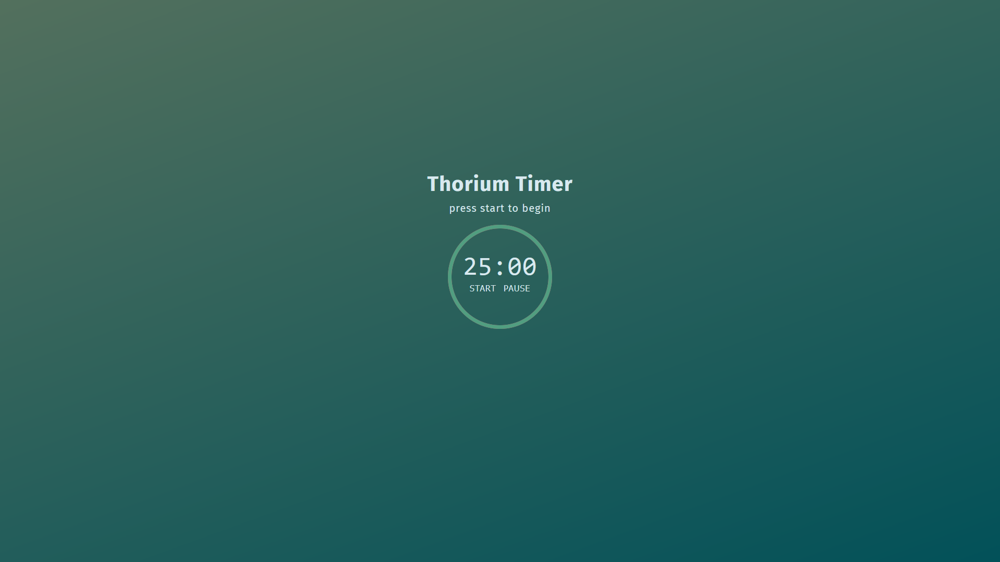

# Thorium Timer

> A pomodoro timer made with HTML, CSS and JS.
> 
> Site: [Thorium Timer](https://marcosalves90.github.io/pomodoroApp/)

### Adjustments and improvements

The project is still under development and the next updates will focus on the following tasks:

- [ ] Allow the time to be changed
- [ ] Add interval